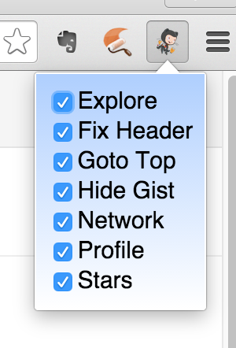
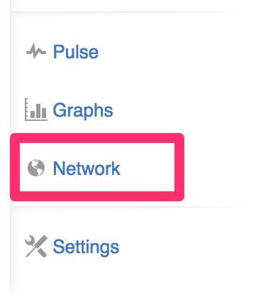

`My GitHub Style` Chrome Extension
==================================

Inspired and based on [github-menu-back](https://github.com/summerblue/github-menu-back)

Customize GitHub UI to your style

Features
--------

* All features default to `ON`

* **Explore**: Show `Explore` link on top menu

* **Fix Header**: Fix head banner always on top

* **Goto Top**: Could `Goto Top`

* **Hide Gist**: Hide `Gist` (Thanks for `GFW`...)

* **Network**: One step to `Network` link

* **Profile**: Old `GitHub Profile` style

* **Stars**: Show `Stars` link on top menu

How to use
----------

1. Clone or download zip of this repository
1. Open `Chrome`, go to `Settings - Options - Extensions` and click on `Developer mode`. You will see the button `Load unpacked extension...` and select the folder in which you extracted the extension
    

License
-------

Source code is release under [MIT license](http://mit-license.org/).

Read LICENSE file for more information.